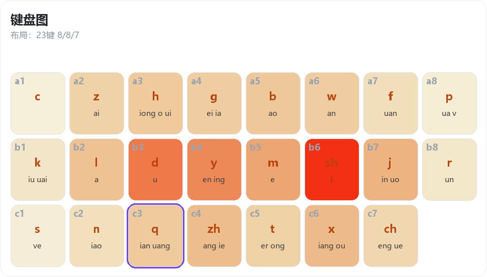
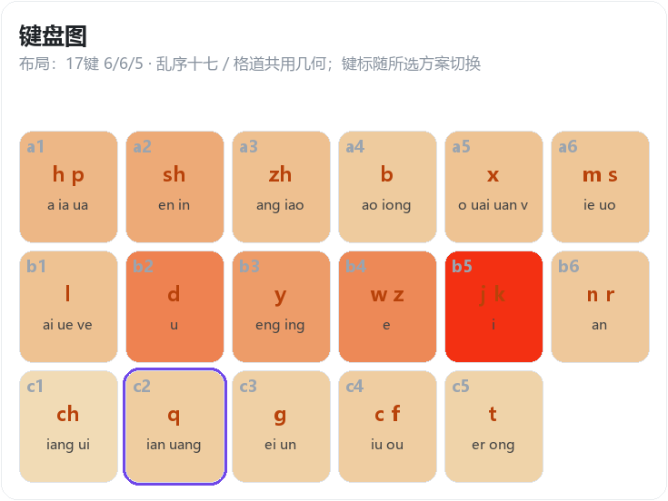
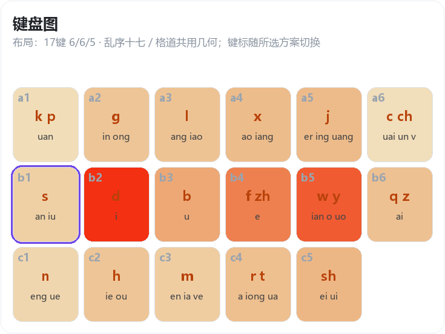
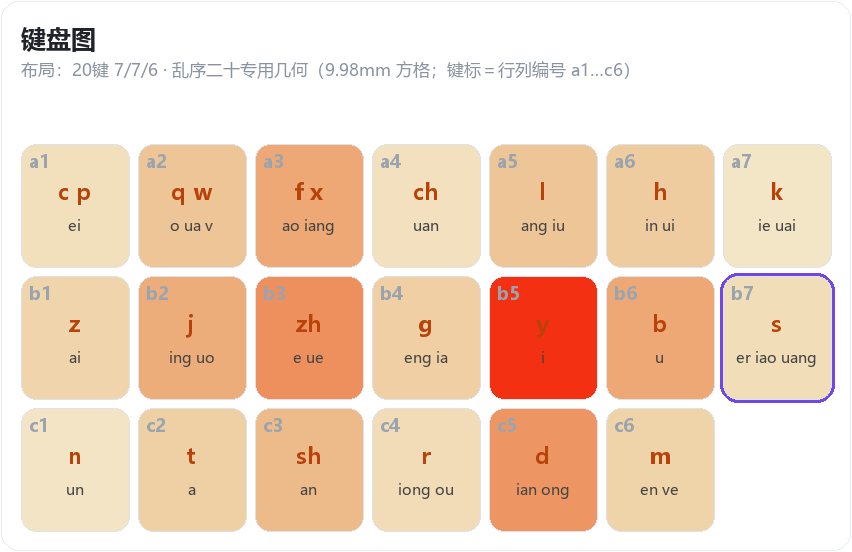
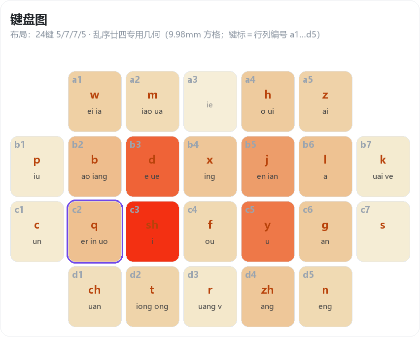
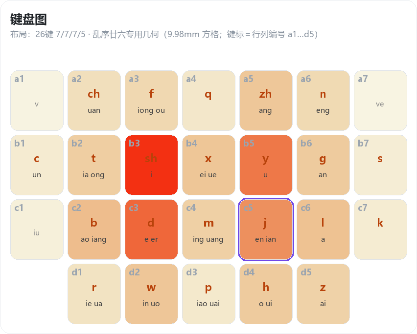
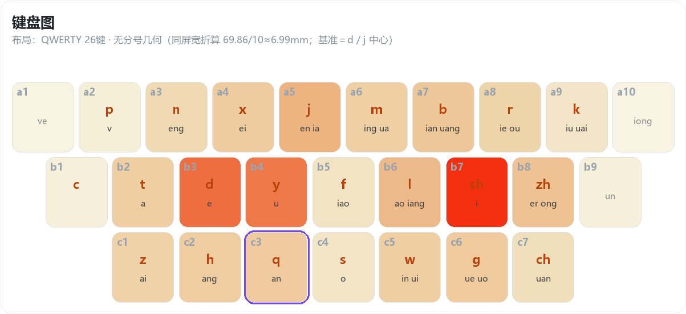
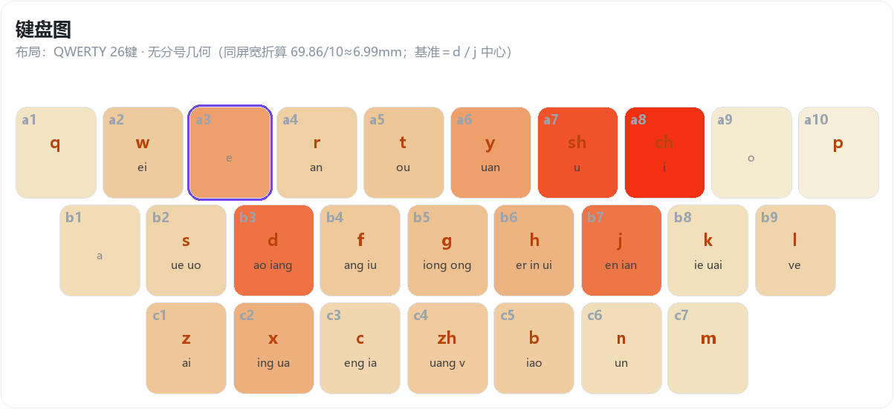

# my-wanxiang

万象拼音（rime-wanxiang）的乱序双拼定制分支，随上游同步 v18.0.10。

**专为手机设计**：默认键位乱序廿三，另有 8 套乱序键位；中文输入状态打 `/lxsq`、`/lx23` 等命令即可换键位（混输、反查、简码一起切），重新部署后生效。

**这是覆盖层，不是完整方案**：需先装官方万象，再用本仓库文件覆盖用户目录里的 `wanxiang_pro` 等文件，不覆盖不生效。

## 键位

| 方案 | 键数 | 布局 | 切换命令 |
| --- | --- | --- | --- |
| 乱序十七（来自林大） | 17 | 6/6/5 | `/lxsq` |
| 十七优化 | 17 | 6/6/5 | `/sqyh` |
| 乱序二十 | 20 | 7/7/6 | `/lx20` |
| **乱序廿三（默认）** | 23 | 8/8/7 | `/lx23` |
| 乱序廿四 | 24 | 5/7/7/5 | `/lx24` |
| 乱序廿六 | 26 | 7/7/7/5 | `/lx26` |
| 乱序手机 | 26 | QWERTY | `/lxsj` |
| 原键优化 | 26 | QWERTY | `/yjyh` |
| 全拼 | 26 | QWERTY | `/pinyin` |

其他命令（中文输入状态直接打，切键位后需重新部署）：`/zjf` 直接辅助（`nire` = 你）、`/jjf` 间接辅助（`ni/re` = 你）、`/wx` 版本号；输入统计 `/btj` `/rtj` `/ztj` `/ytj` `/ntj` `/tj`（本机 / 今日 / 本周 / 本月 / 本年 / 全部）、`/htj…` 历史查询。

### 键位图

图里底色越红表示该键使用频次越高，紫框是零声母首键。

乱序廿三（默认）：

乱序十七：

十七优化：

乱序二十：

乱序廿四：

乱序廿六：

乱序手机：

原键优化：

## 辅助码

词库里的音节写成 `拼音;两位辅码`，比如 `了 le;vl`、`的 de;bu`。辅码键位（键标就是声母代号）看字根表：

- `乱序双拼/dicts/辅助码字根表.png`：**小鹤辅**的乱序廿三修改，现在的词库就是按它来的
- `乱序十七辅助码/辅助码字根表.png`：乱序十七的口径（仅存储备份，非实用）

`乱序双拼/dicts/` 下 16 个 pro 词库和 `lua/data/chaifen.txt`（8358 字）带的都是「乱序廿三修改」辅码（在乱序廿三码表基础上修订过），跟默认键位配套；切到别的键位时由 `wanxiang_algebra_lx.yaml` 换算。

## 目录

- `乱序双拼/`：要覆盖的部署文件（schema / algebra / 词库 / `_lx` lua / `chaifen.txt` / `custom/` 模板），另有字根表和键位图
- `乱序十七辅助码/`：资料目录，不用部署

## 安装

- 下载安装官方万象拼音（rime-wanxiang）
- 把 `乱序双拼/` 里的文件覆盖进rime用户目录
- 勾选方案后部署

## 来源

- 上游 [amzxyz/rime-wanxiang](https://github.com/amzxyz/rime-wanxiang)
- 本仓库地址：<https://github.com/gh0x7e/my-wanxiang>
